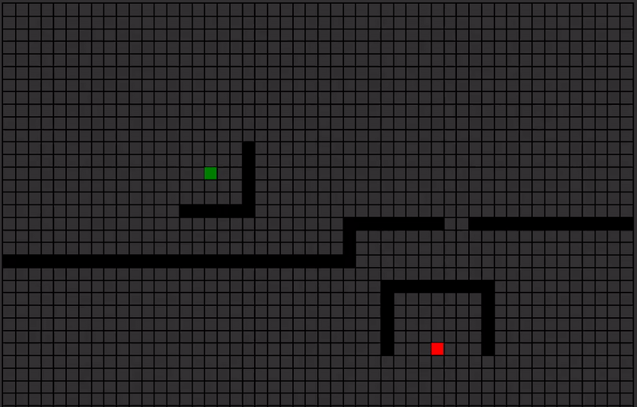

# Path finding

Find the shortest path from A to B with this path finder in your browser. Try it out [here](http://folk.ntnu.no/frodal/Cite/Projects/Path-finding.html).

## Getting Started

To get a local copy up and running follow these simple steps.

1. Clone the project or download from Github (`git clone --recursive https://github.com/frodal/path-finding.git`)
2. Install [Visual Studio Code](https://code.visualstudio.com/)
3. Install the [Live Server extension](https://marketplace.visualstudio.com/items?itemName=ritwickdey.LiveServer)
4. Open `./src/html/index.html` with the Live Server in VS Code.

## Contributing

To contribute:

1. Fork the Project
2. Create your Feature Branch (`git checkout -b feature/AmazingFeature`)
3. Commit your Changes (`git commit -m 'Add some AmazingFeature'`)
4. Push to the Branch (`git push origin feature/AmazingFeature`)
5. Open a Pull Request

## License

Distributed under the [MIT License](https://mit-license.org/).
See `LICENSE` for more information.

## Contact

Bjørn Håkon Frodal - [@frodal](https://github.com/frodal) - bjorn.h.frodal@ntnu.no

Project Link: [https://github.com/frodal/path-finding](https://github.com/frodal/path-finding)
